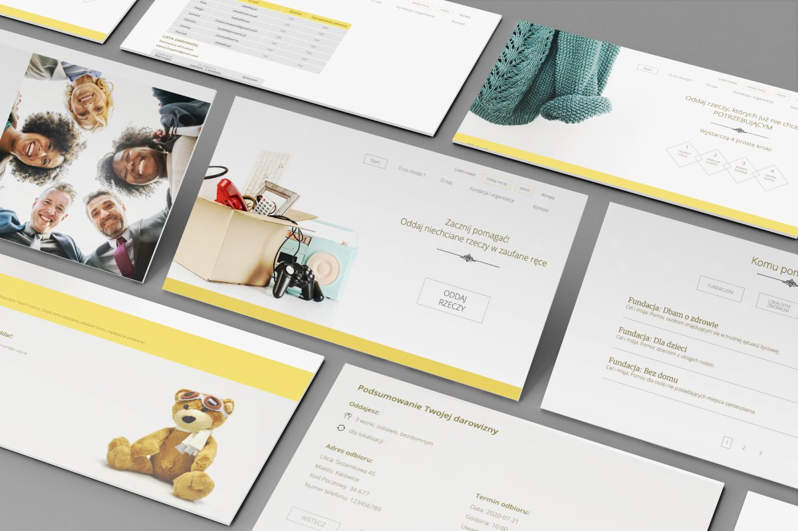
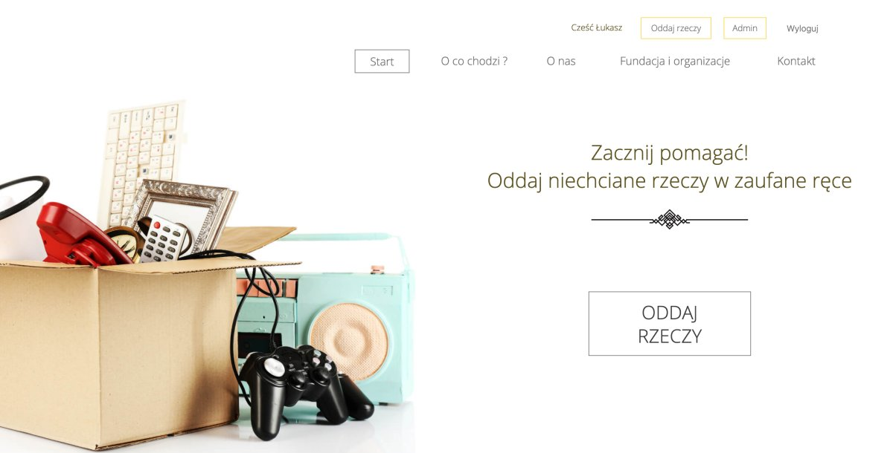
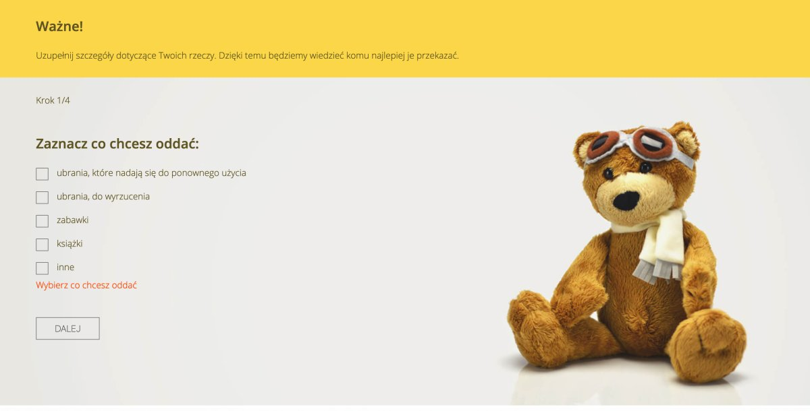
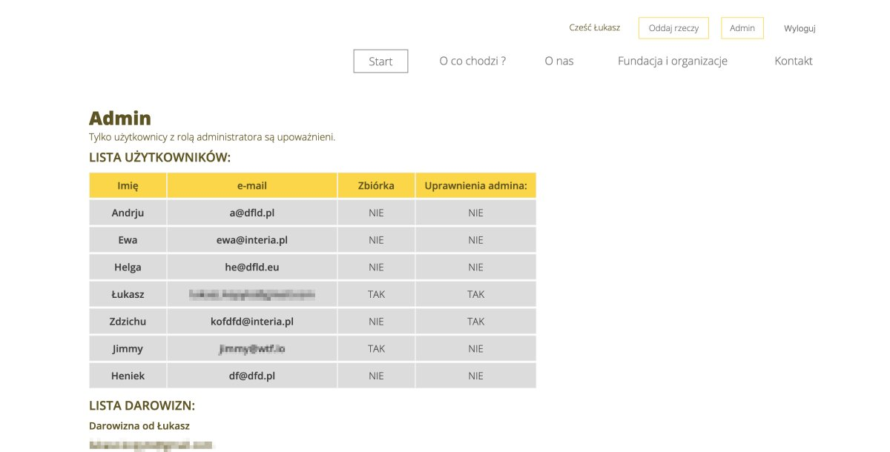

b# Oddam w dobre ręce - React app

> The project aims is to create a place where every one can donate unnecessary things to trusted institutions. This project is the part of the Coders Lab course.

## Table of contents

- [General info](#general-info)
- [Screenshots](#screenshots)
- [Technologies](#technologies)
- [Features](#features)
- [Setup](#setup)

## General info

The project aims is to create a place where every one can donate unnecessary things to trusted institutions.

The project will be a website with form that will make it easier for users to return items.

- This project was created as a representation of an existing UX project
- based on a design in [Adobe XD](https://xd.adobe.com/spec/f11fc670-7af2-4502-4013-c1f66f8d3332-872e/grid) without RWD
- bootstrapped with Create React App.

## Live demo

## Screenshots

## Technologies

- React, based on:
  - Hooks,
  - Context API,
- React-router
- React-scroll
- Formik (Multi step form)
- Fetch (send contact form to the Coders Lab API)
- Firebase (Authentication, Protected Route with Authorization, Realtime Database)
- Sass
- Netlify
- Google Fonts

## Features

- list of institutions in the form of three tabs with pagination for each
- contact form with validation and sending data to API
- smooth scrolling on Home Page
- a complex multi-step form "oddaj rzeczy":
  - using Formik with validation and error messages, and manage form state
  - custom checkboxes, radio buttons, select element
  - date picker
  - displaying a summary of the form
  - save the form data to the Firebase Realtime Database
- display a summary on the home page based on the Firebase Realtime Database data, sent from the "oddaj rzeczy" form
- Firebase authentication:
  - Sign Up (register with the ability to create an admin account)
  - Sign In
  - Sign Out
  - password reset
  - session handling
- protected route with admin authorization
- administrator view with a summary of all users and form data

## Setup

In the project directory, you can run:

### `npm start`

Runs the app in the development mode. 
Open [http://localhost:3000](http://localhost:3000) to view it in the browser.

The page will reload if you make edits. 
You will also see any lint errors in the console.

### `npm run build`

Builds the app for production to the `build` folder. 
It correctly bundles React in production mode and optimizes the build for the best performance.
